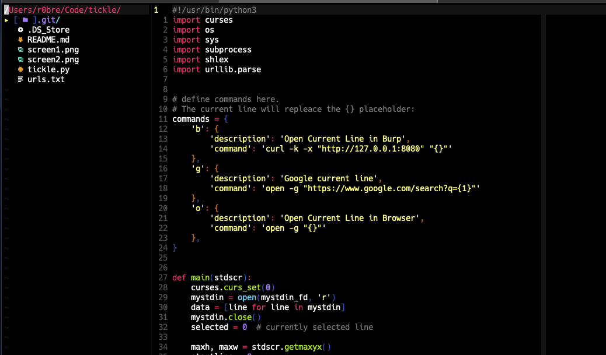

# vim-monokai-tasty - black bg fork
This is a fork of `vim-monokai-tasty` which simply makes the background color
black, and adjusts the dark-grayish colors to be a bit darker. The screenshot
shows what I mean:

You can compare it to the original colorscheme included below:

## Original Readme below.

---

# vim-monokai-tasty

[](http://makeapullrequest.com)
[](https://GitHub.com/Naereen/StrapDown.js/graphs/commit-activity)

[](https://en.cryptobadges.io/donate/1AddzniWjahrTidwC1QhBkcX7RYwn2JVoq)

Monokai forever! :tada: Inspired by Sublime Text's interpretation of monokai, this colour is both gui- and cterm-supported.
It works for all languages, and is particularly good for JavaScript and TypeScript development :heart:

Unlike other monokai implementations, `vim-monokai-tasty` targets named syntax groups from a variety of modern syntax group plugins (listed below). _*74% tastier than competitors_ :taco:

*according to me


## :electric_plug: Installation

I recommend using [Plug](https://github.com/junegunn/vim-plug).

Add the following to your `.vimrc` and run `PlugInstall`

```vim
Plug 'patstockwell/vim-monokai-tasty'
```

If you use _Vundle_:
```vim
Plugin 'patstockwell/vim-monokai-tasty'
```

## :wolf: Use

Add the following to your `.vimrc` (after the Plug declaration):
```vim
colorscheme vim-monokai-tasty
```

If you use a terminal that supports italic text, add (before the colorscheme declaration):
```vim
let g:vim_monokai_tasty_italic = 1
colorscheme vim-monokai-tasty
```

To use the included [lightline.vim](https://github.com/itchyny/lightline.vim) theme:
```vim
let g:lightline = {
      \ 'colorscheme': 'monokai_tasty',
      \ }
```

To use the included [vim-airline](https://github.com/vim-airline/vim-airline) theme:
```vim
let g:airline_theme='monokai_tasty'
```

## :books: Additional plugins with targeted syntax groups
For JavaScript, TypeScript, and React development, _monokai-tasty_ supports definitions from all these plugins.
Add some of these for an even better look and feel:
```vim
Plug 'HerringtonDarkholme/yats.vim'
Plug 'pangloss/vim-javascript'
Plug 'MaxMEllon/vim-jsx-pretty'
Plug 'styled-components/vim-styled-components'
Plug 'elzr/vim-json'
Plug 'jparise/vim-graphql'
```

## :crystal_ball: Extras

- If you use [iterm2](https://iterm2.com/) (you should), there is an included _monokai.itermcolors_ file.
- If you use GnuCoreutils there is a _dircolors_ file (compliments the iterm colours)

## :tv: Screen shots


## :star: Example `.vimrc`

```vim
" put Plug declaration first
call plug#begin('~/.vim/plugged')
Plug 'patstockwell/vim-monokai-tasty'
Plug 'HerringtonDarkholme/yats.vim'
Plug 'pangloss/vim-javascript'
Plug 'MaxMEllon/vim-jsx-pretty'
Plug 'elzr/vim-json'
Plug 'styled-components/vim-styled-components'
Plug 'itchyny/lightline.vim'
Plug 'vim-airline/vim-airline'
call plug#end()

let g:vim_monokai_tasty_italic = 1                    " allow italics, set this before the colorscheme
colorscheme vim-monokai-tasty                         " set the colorscheme

" Optional themes for airline/lightline
let g:airline_theme='monokai_tasty'                   " airline theme
let g:lightline = { 'colorscheme': 'monokai_tasty' }  " lightline theme

" If you don't like a particular colour choice from `vim-monokai-tasty`, you can
" override it here. For example, to change the colour of the search hightlight:
hi Search guifg=#bada55 guibg=#000000 gui=bold ctermfg=green ctermbg=black cterm=bold

" If you don't know what the name of a particular hightlight is, you can use
" `What`. It will print out the syntax group that the cursor is currently above.
" from https://www.reddit.com/r/vim/comments/6z4aau/how_to_stop_vim_from_autohighlighting_italics_in/
command! What echo synIDattr(synID(line('.'), col('.'), 1), 'name')

```

## :art: Colour palette

| Colour name      |Colour Code | Colour
|------------------|------------|------------------------------------------------------------
| Yellow           | `#ffff87`  |
| Purple           | `#af87ff`  |
| Light Green      | `#A4E400`  |
| Light Blue       | `#62D8F1`  |
| Magenta          | `#FC1A70`  |
| Orange           | `#FF9700`  |

## :building_construction: Support
If you like `vim-monokai-tasty` or find this plugin useful, you can support me by donating bitcoin to the following address.

[](https://en.cryptobadges.io/donate/1AddzniWjahrTidwC1QhBkcX7RYwn2JVoq)


